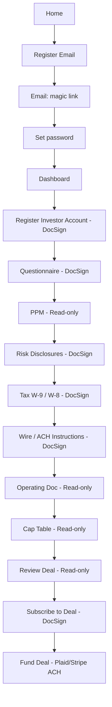

# User flow (Mermaid)

Use this in GitHub/GitLab previews or any Mermaid renderer. Aligns with `AGENTS.md`.

## Wireframe checklist (for Figma/Lucid)

- Home: hero, thesis (fix-and-flip), trust signals, primary CTA → register.
- Register: email field, consent checkbox, submit.
- Post-login shells: document viewer, deal cards, subscription summary (stub until backend exists).
